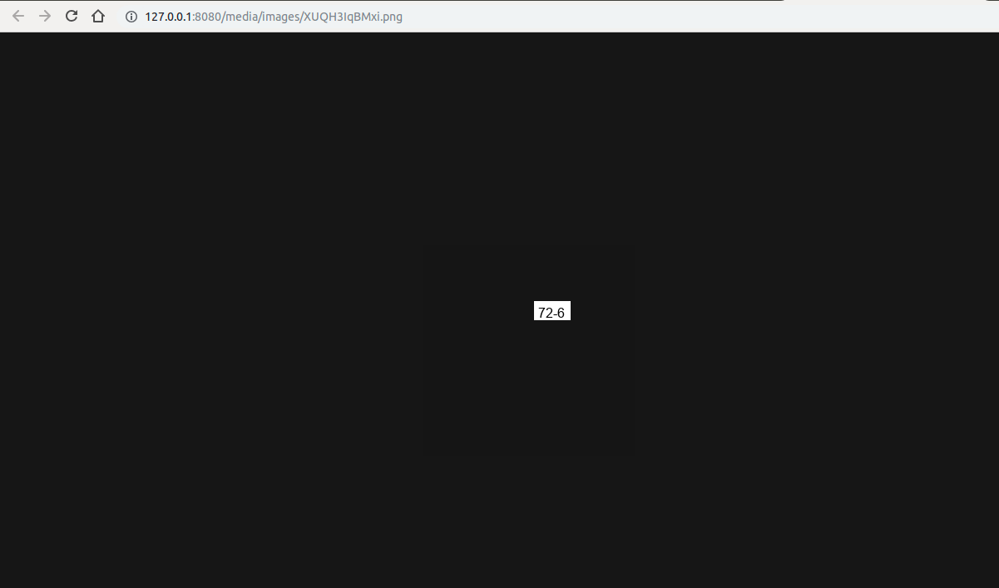
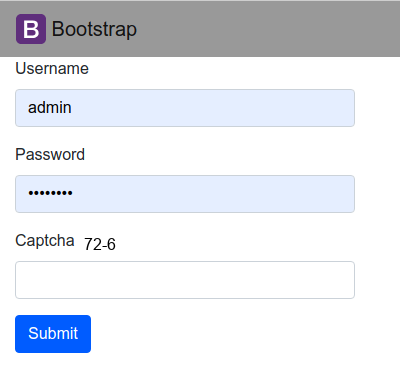

# django-captcha
Implementing captcha for user login. Fortunately google has it's own captcha system which is always a step ahead of bots but I thought I'd implement my own version just for kicks.

The captcha expects you to do simple arithmetics either add two numbers or subtract them and use that as you log in.

If you fail you get a new captcha rule.

The key thing here is that basic bots won't be able to parse text from an image, since my site isn't a high value target in this scenario the "likely" hackers won't have Object Character Recognition scripts to get the text, parse it and use this to complete validation.

Making the text wavy or obstructed by noise so the OCR will have a higher fail rate is doable but for now this was just a proof of concept work.
